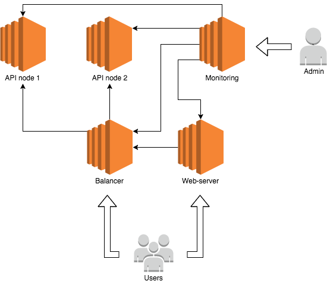

# Тестовое задание на позицию DevOps Engineer

## Описание сервиса

Компания планирует предоставлять пользователям полезный REST API, к которому можно обратиться по следующим точкам входа:

- `/`
- `/ring-ring`

и получить в качестве результата уникальный JSON-документ.

Для демонстрации пользователям возможностей API дизайнер компании создал посадочную страницу `app/index.html`. На странице содержится описание сервиса и результат обращения к одной из точек входа, полученный AJAX-запросом.

## Инфраструктура

Компания хочет, чтобы сервис был отказоустойчивым и производительным. После напряжённых мозговых штурмов спроектирована схема, состоящая из двух API-серверов, балансировщика нагрузки, сервера мониторинга и веб-сервера, с которого пользователям будет доступна посадочная страница.

Компания выдвинула следующие требования к инфраструктуре:

- в качестве серверов используются виртуальные машины, созданные на сервисе [Amazon EC2](https://aws.amazon.com/ec2) из образов `Amazon Linux AMI 2017.03.1` или `Ubuntu Server 16.04 LTS`. Инженер предоставит команде системных администраторов доступ по SSH на виртуальные машины.

- для удобной доставки пользователям новых версий API, было решено использовать [Docker](https://www.docker.com) как средство виртуализации и изоляции запущенных инстансов приложения. Инженеру предстоит:

  1. описать конфигурационный dockerfile приложения на основе образа [Node.js](https://hub.docker.com/_/node);
  
  2. настроить автоматическую сборку образа при обновлении исходного кода приложения, используя средства [GitLab CI](https://about.gitlab.com/features/gitlab-ci-cd), и публикацию образа в публичный репозиторий на [hub.docker.com](https://hub.docker.com);
  
  3. реализовать автоматизированную доставку новых версий API на сервера (если будет реализован zero-downtime deployment, то инженер получит дополнительную неделю отпуска).

- в случае полного отказа одного из серверов либо сбоя в работе API-приложения, сервис должен оставаться доступным. Сбоем приложения решили считать превышение времени ожидания ответа в 2 секунды либо ответ с `50x` HTTP-кодом с любой точки входа. Балансировка запросов к API должна происходить по алгоритму Round Robin (если будет применён алгоритм Least Connections, инженер получит долгожданное повышение зарплаты).

- пользователи API могут напрямую обращаться к балансировщику по предусмотренным в API точкам входа;

- пользователям сервиса доступна посадочная страница, размещённая на отдельном сервере. В качестве веб-сервера компания хочет использовать [Apache](https://httpd.apache.org) или [nginx](https://www.nginx.com/resources/wiki). На веб-сервере будет настроено проксирование запросов к балансировщику для корректной работы примера обращения к API на посадочной странице.

- администраторам доступен веб-интерфейс для мониторинга важных (по мнению инженера) метрик инстансов приложений API, балансировщика и веб-сервера с посадочной страницей. В качестве сервиса мониторинга используется [Prometheus](https://prometheus.io) или любое аналогичное решение.

## Результат

Результатом выполнения задачи станет: 

  1. полностью функционирующий стек, соответствующий приведённой логической схеме и учитывающий все требования спецификации;
  
  2. набор скриптов и конфигурационных файлов, используя который возможно развернуть аналогичный стек на пустых серверах. Код, реализующий инфраструктуру, находится в отдельной ветке форка репозитория [prog13/devops-test-task](https://gitlab.com/prog13/devops-test-task) и для него создан merge-request;
  
  3. уделено внимание вопросу хранения чувствительной информации — в репозитории не должны находиться в открытом виде любые ключи, токены, пароли, etc.
  
  4. наличие реквизитов (ключей) для доступа по SSH на все ресурсы стека;
  
## Срок выполнения

На выполнение задания компания выделила один двухнедельный спринт.
